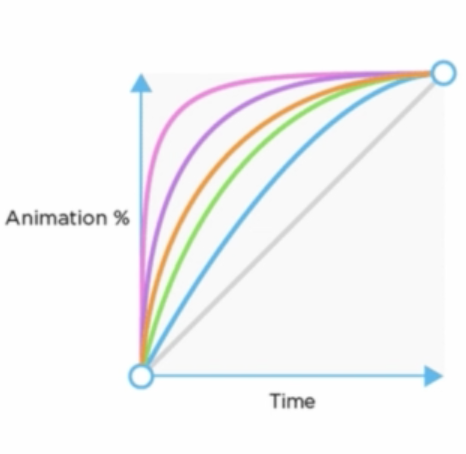

# Guide complet des animations en CSS

_Auteur Udemy: Axel Paris_

## Mouvement CSS

- Propriété `transition` (via sélecteurs)
- Propriété `animation` + `Keyframes`

## Eléments animables

- background-color
- width / height
- margin
- padding
- font-size
- ...

### Performances

exemple : Position vs **Transform**

Transitions gourmancdes :

- width
- padding
- position
- ...
- color

Vos transitions performantes avec...

- opacity
- translate
- rotate
- scale

## Propriété `transition`

```css
.element {
  transition: <property> <duration> <timing-function> <delay>;
}
```

ou

```css
.element {
  transition-property: <property>;
  transition-duration: <duration>;
  transition-timing-function: <timing-function>;
  transition-delay: <delay>;
}
```

exemple:

```css
.box {
  transition: opacity 200ms ease-in 1s;
}
```

### Timing function



#### Cubic bezier

```css
.element {
  transition-timing-function: cubic-bezier(x1, x2, x3, x4);
}
```

Démo : [cubic-bezier.com](https://cubic-bezier.com)

### Déclancher une transition CSS

```css
.element:hover
.element:active
.element:focus
...
.element.classname
.element#idname
...
```

```css
#button {
    opacity: 0.5;
    transition-duration 1s;
}

#button.active {
    opacity: 1;
}
```

```javascript
var element = document.getElementById("button");
element.cla & ssList.toggleClass("active");
```

Mauvaise pratique :

```css
.element {
  background-color: red;
}

.element:hover {
  background-color: blue;
  transition-duration: 1s;
}
```

Bonne pratique :

```css
.element {
  background-color: red;
  transition-duration: 1s;
}

.element:hover {
  background-color: blue;
}
```

Mettre les transitions dans l'état initial

### Exercices

Exercice 1 : [Enoncé](https://codepen.io/AxelParis/pen/qwrjrN) -> [Corrigé](https://codepen.io/bogala/pen/abzpLdz)

Exercice 2 : [Enoncé](https://codepen.io/AxelParis/pen/YMZQbe) -> [Corrigé](https://codepen.io/bogala/pen/jOEyGMQ)

Exercice 3 : [Enoncé](https://codepen.io/AxelParis/pen/OGpjbG) -> [Corrigé](https://codepen.io/bogala/pen/WNbRZRg)

Exercice 4 : [Enoncé](https://codepen.io/AxelParis/pen/wZJrGz) -> [Corrigé](https://codepen.io/bogala/pen/bGNgoWj)

## Les @Keyframes

```css
@keyframes <animation name> {
  <keyframe-selector > {
    property: value;
  }
}
```

exemple

```css
@keyframes ballRebond {
  0% {
    top: 0px;
  }
  50% {
    top: 100px;
  }
  100% {
    top: 0px;
  }
}
```

ou

```css
@keyframes ballRebond {
  0%,
  100% {
    top: 0px;
  }
  50% {
    top: 100px;
  }
}
```

ou encore

```css
@keyframes ballRebond {
  from,
  to {
    top: 0px;
  }
  50% {
    top: 100px;
  }
}
```

### Animer les keyframes

```css
.elementToAnimate {
  animation-name: <animation-name>; // obligatoire
  animation-duration: <animation-duration>; //obligatoire
  animation-timing-function: <animation-timing-function>;
  animation-delay: <animation-delay>;
  animation-iteration-count: <animation-iteration-count>;
  animation-direction: <animation-direction>;
  animation-fill-mode: <animation-fill-mode>;
  animation-play-state: <animation-play-state>;
}
```

### Outils pour créer vos keyframes

- [Keyframes Editor](https://keyframes.app/editor/)
- [CSS Animate](http://cssanimate.com/)
